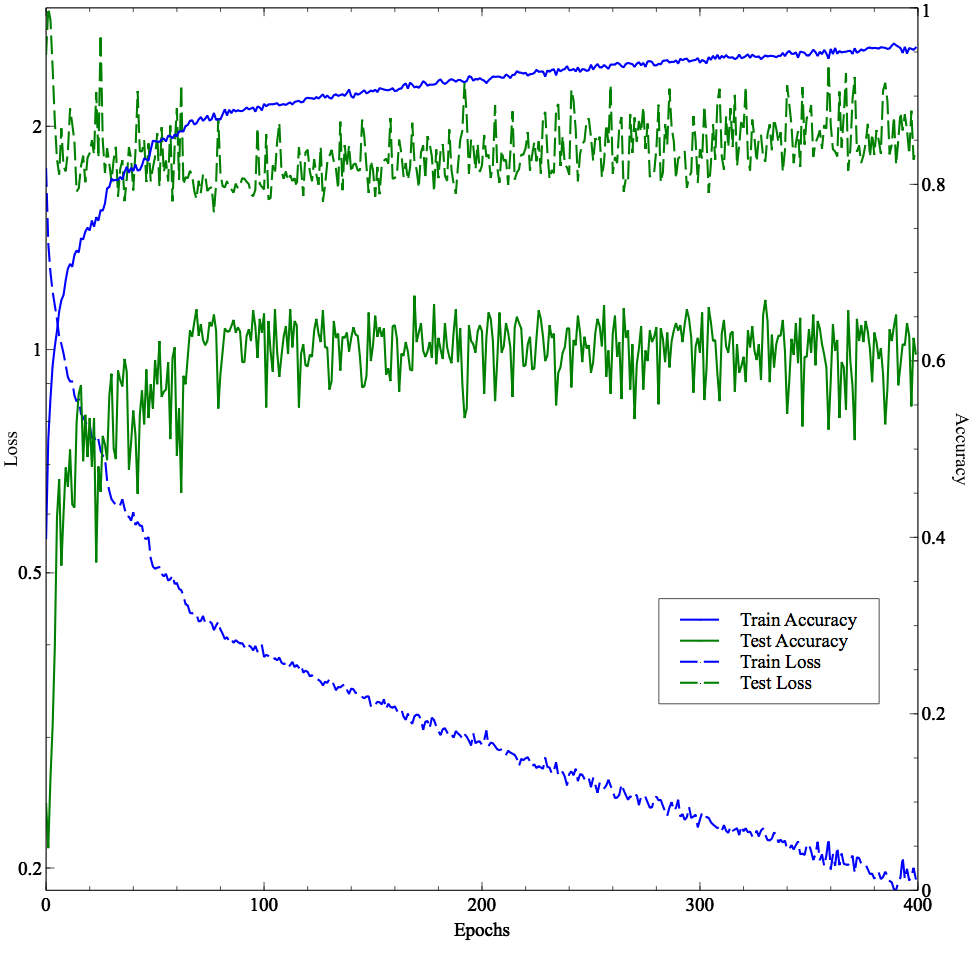
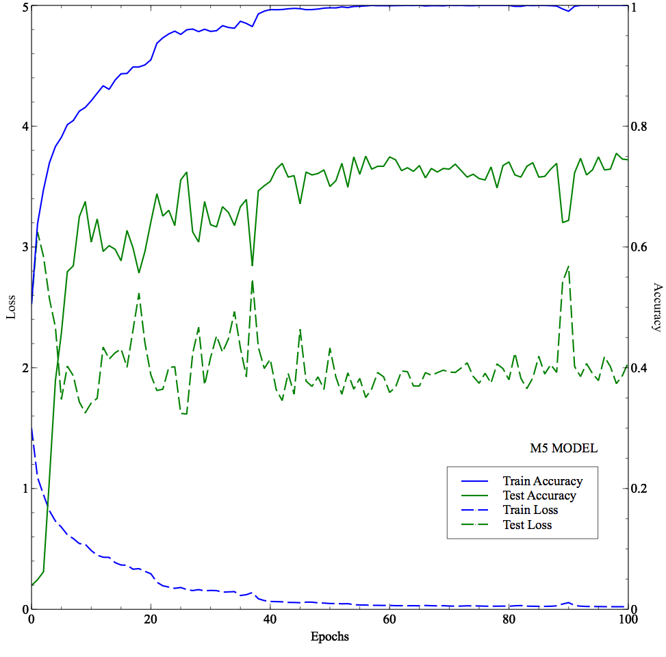

# Very Deep Convolutional Networks For Raw Waveforms
Tensorflow 1.0 implementation of the paper: https://arxiv.org/pdf/1610.00087.pdf

*From Stanford University and US Bosch*

```
[x] M3 has been implemented so far!
[x] M5
[x] M11
[x] M18
[x] M34 Res
```

<div align="center">
  <b>M3 model - best accuracy: 0.648</b><br>
  <br><br>
</div>


<div align="center">
  <b>M5 model - best accuracy: 0.755</b><br>
  <br><br>
</div>

<div align="center">
  <b>M11 model - best accuracy: 0.758</b><br>
  <br><br>
</div>
