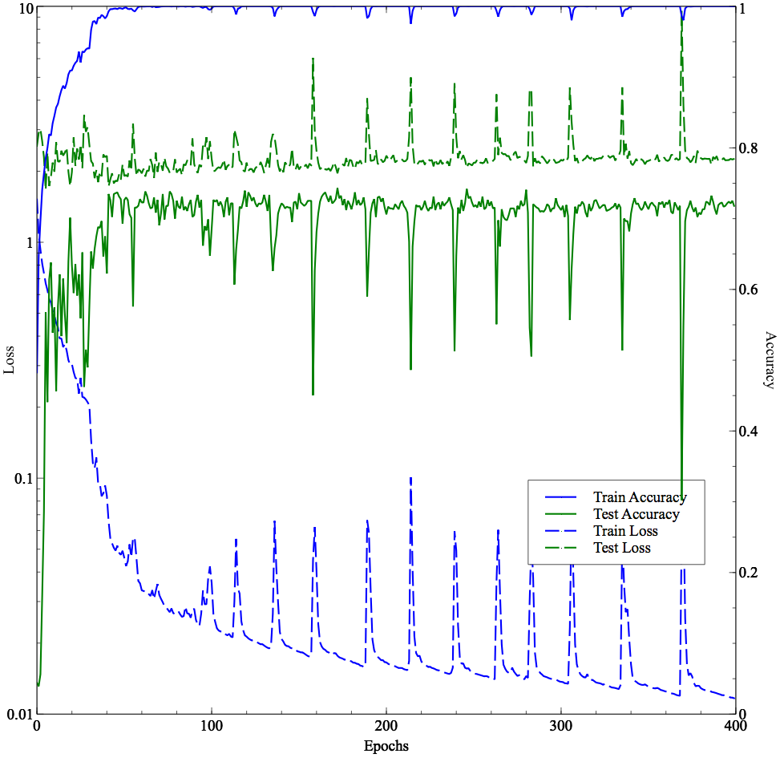
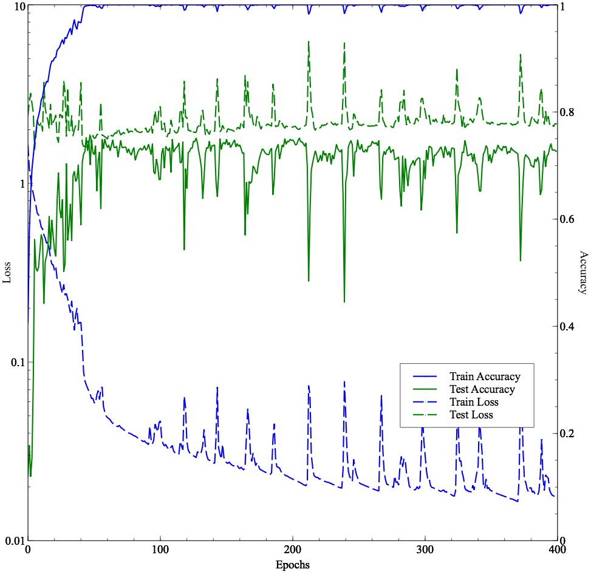
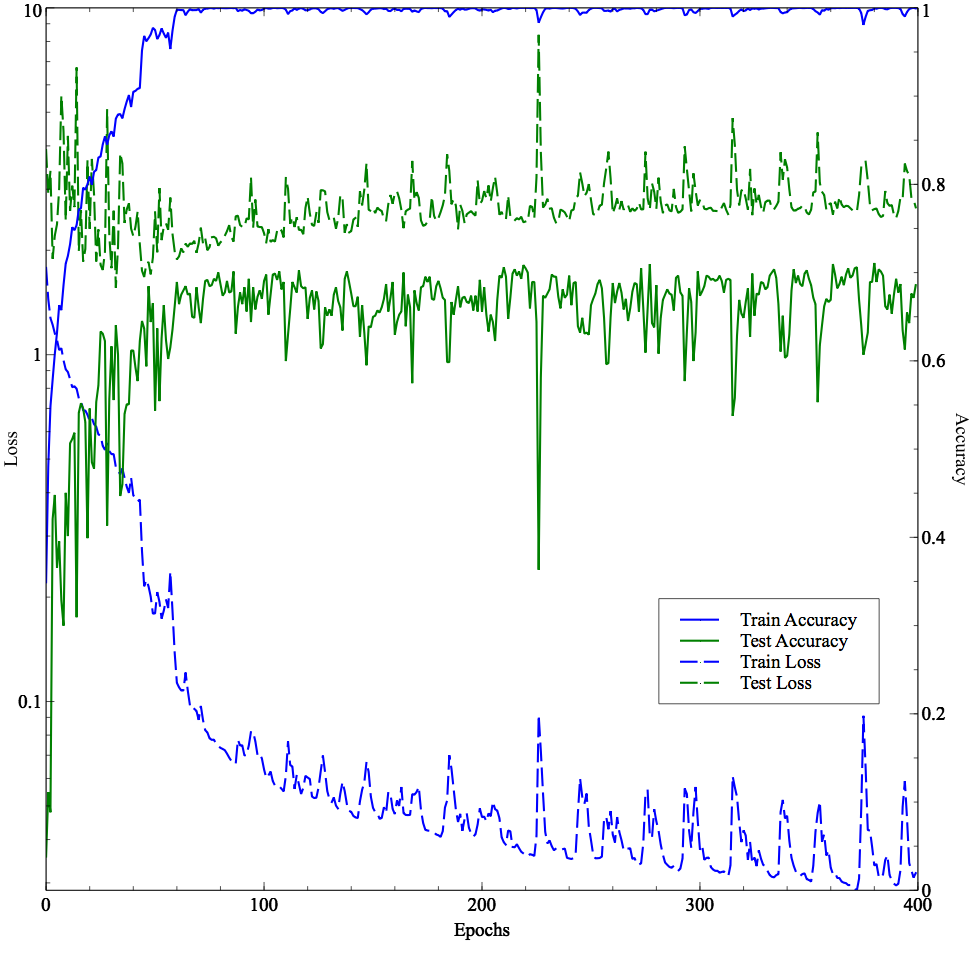
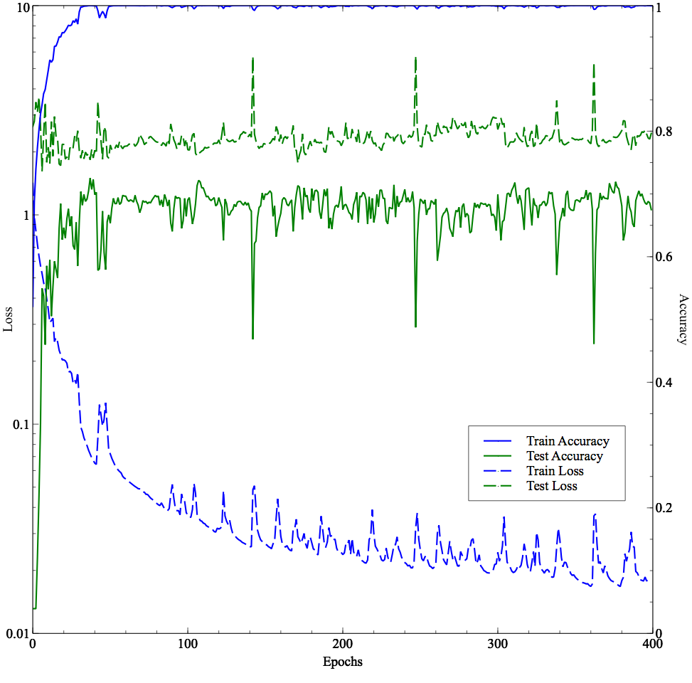

# Very Deep Convolutional Networks For Raw Waveforms
Keras (Tensorflow) implementation of the paper: https://arxiv.org/pdf/1610.00087.pdf

## Notes:
- Going really deep does not seem to help much on this dataset. We clearly overfit very easily. Adding more regularization might help. I haven't tried to use the FC layers (though it has been implemented).
- We use the `fold10` folder for the **testing set** and the remaining for the **training set**.
- Models implemented:
```
[x] M3
[x] M5
[x] M11
[x] M18
[x] M34 (ResNet)
```

## How to re-run the experiments?

Dataset can be downloaded here: http://urbansounddataset.weebly.com/urbansound8k.html

```
git clone https://github.com/philipperemy/very-deep-convnets-raw-waveforms.git
cd very-deep-convnets-raw-waveforms
sudo pip3 install -r requirements.txt
./run_all.sh # will run M3, M5, M11, M18 and M34
```

<div align="center">
  <b>M3 model - best accuracy: 0.673, trainable params = 221,194</b><br>
  <br><br>
</div>


<div align="center">
  <b>M5 model - best accuracy: 0.743, trainable params = 559,114</b><br>
  <br><br>
</div>

<div align="center">
  <b>M11 model - best accuracy: 0.752, trainable params = 1,786,442</b><br>
  <br><br>
</div>

<div align="center">
  <b>M18 model - best accuracy: 0.710, trainable params = 3,683,786</b><br>
  <br><br>
</div>

<div align="center">
  <b>M34 model - best accuracy: 0.725, trainable params = 3,984,154</b><br>
  <br><br>
</div>

